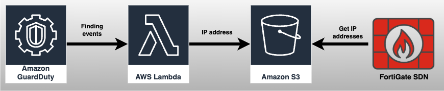
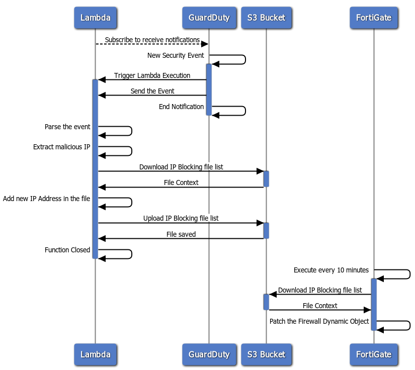

# FortiGate aws-lambda-guardduty - Parse GuardDuty Event

### Process Flows

The project source includes function code and supporting resources:

- `function` - A Python function.
- `template.yml` - An AWS CloudFormation template that creates and configure this application.
- `automation.py` - Python scripts that use the AWS CLI to deploy and manage this application.

Use the following instructions to deploy this application.

## Requirements
- [Python 3.13](https://www.python.org/downloads/).
- The Bash shell. For Linux and macOS, this is included by default. In Windows 10, you can install the [Windows Subsystem for Linux](https://docs.microsoft.com/en-us/windows/wsl/install-win10) to get a Windows-integrated version of Ubuntu and Bash.
- [The AWS CLI](https://docs.aws.amazon.com/cli/latest/userguide/cli-chap-install.html) v2.24.7 or newer.

### Python Lib Requirements
- jsonpickle 4.0.2
- aws-xray-sdk 2.14.0
- jmespath 1.0.1
- boto3

## Resources
Upon executing the #3 script, a CloudFormation Stack will be created, provisioning the following resources:
 * EventBridge Rule: A rule that acts as a trigger for the Serverless function, filtering only GuardDuty Findings events.
 * IAM Role and Policy: Automatically configured roles and policies required for the Serverless function and the EventBridge Rule.
 * Lambda Function (Serverless): The automation script packages and uploads all necessary files to an S3 bucket, then creates a new Lambda function.

In total, eight resources are deployed, including rules, IAM roles, and the Lambda function.

### IAM Role and Policy
The CloudFormation Template (CFT) will create specific IAM roles and policies, explicitly defined in the `template.yml` file. Below are the scope and permissions assigned by the CFT:

#### Lambda Function

The function will have restricted access to a specific S3 bucket and the necessary permissions to execute. These include:
- AWSLambdaBasicExecutionRole
- AWSLambda_ReadOnlyAccess
- AWSXrayWriteOnlyAccess
- s3:ListAllMyBuckets
- s3:GetObject
- s3:PutObject

#### Event Rule

This rule will grant permission to events.amazonaws.com and allow it to invoke only our serverless function. The assigned permissions are:
- sts:AssumeRole
- lambda:InvokeFunction

## Setup
Download or clone this repository.

    git clone git@github.com:Cloud-Solutions-Architects/aws-lambda-guardduty.git
    cd aws-lambda-guardduty

Edit the file `.env` changing to your S3 Bucket name, file name inside the S3 Bucket that will have a list of IP addresss, and the region the serverless function will run.

> Make sure you have valid credentials to your AWS environment.

To create a new bucket for deployment artifacts, run `python3 automation.py --step 0`.

    python3 automation.py --step 0

Example output:

    [MainThread] [INFO ]  Starting automation script.
    [MainThread] [INFO ]  Creating S3 bucket.
    [MainThread] [INFO ]  Found credentials in environment variables.
    [MainThread] [INFO ]  Creating S3 bucket - Done.

It means the S3 bucket got created and a new empty file is already there.

### Automation Deploy
To deploy the application, run `python3 automation.py --step 1`.

    python3 automation.py --step 1
    
This script will:
- Install Lambda function required packages.
- Upload Lambda functions and libraris to S3 bucket.
- Create the Lambda functions and it's IAM role.
- Create the CloudWatch Filter and it's IAM role.

If the AWS CloudFormation stack that contains the resources already exists, the script updates it with any changes to the template or function code.

# FortiGate Configuration
> [Link](https://docs.fortinet.com/document/fortimanager-public-cloud/7.6.0/aws-administration-guide/486923/sdn-connector-integration-with-aws) for the Official documentation